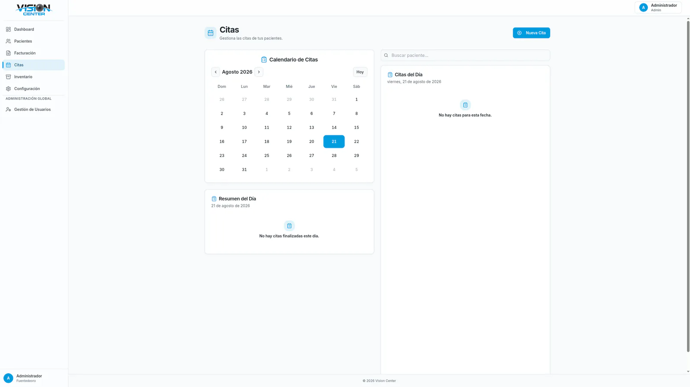
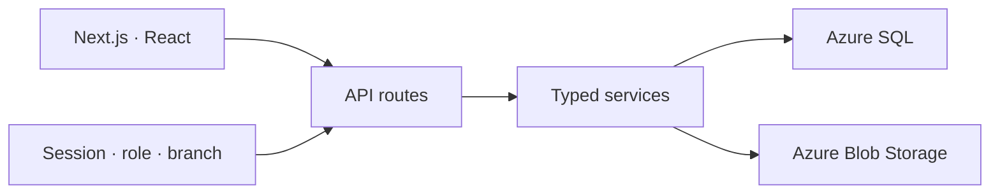
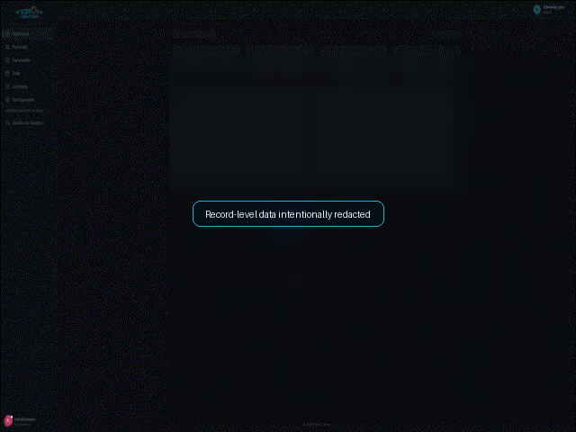

# Vision Center — Optical Clinic Management

### Multi-branch clinical and commercial workflows built with Next.js, TypeScript, and SQL Server

[](https://nextjs.org/) [](https://react.dev/) [](https://www.typescriptlang.org/) [](https://www.microsoft.com/sql-server/)
[](https://github.com/Johan-Alvarez-Dev/vision-center-case-study/actions/workflows/ci.yml)

Vision Center connects patients, appointments, clinical records, optical prescriptions, inventory, billing, documents, and user management under a multi-branch authorization model.

> This project demonstrates my TypeScript/Next.js side. It does not claim to be a .NET application. Clinical data, SQL schema, documents, and production source remain private.

[Open the live demo](https://vision-center-app.vercel.app/) · [Product tour](./docs/product-tour.md) · [Architecture](./docs/architecture.md) · [Code samples](./sample-code) · [Video](#video-walkthrough)

<picture>
  <source media="(max-width: 900px)" srcset="./screenshots/vision-center-appointments-light-900.webp">
  
</picture>

## The problem

An optical clinic must connect clinical and commercial workflows without leaking records across branches. The application also needs to remain usable on constrained front-desk hardware.

## My role

I implemented the full-stack Next.js application: UI flows, API routes, TypeScript services, SQL Server integration, sessions/roles, Azure Blob Storage, multi-branch authorization, and performance-oriented loading/caching.

## Engineering highlights

- Next.js App Router and React 19.
- Typed API routes and service boundaries.
- Azure SQL / SQL Server stored procedures and versioned migrations.
- Persisted sessions, bcrypt password hashing, and role checks.
- Branch isolation across patients, inventory, and billing.
- Azure Blob Storage for documents.
- Lazy loading, bounded TTL/LRU caching, and device-aware UI behavior.
- Logical deletion and audit-friendly data handling.

## Architecture



Read [architecture](./docs/architecture.md), [decisions](./docs/decisions.md), and [engineering evidence](./docs/engineering-evidence.md).

## Public code samples

| Sample | Demonstrates |
| --- | --- |
| `branch-scope.ts` | Fail-closed branch authorization |
| `ttl-lru-cache.ts` | Bounded caching with deterministic expiry |
| `patient-query.ts` | Normalized pagination/filter contracts |
| Node tests | Branch isolation, cache eviction, invalid input |

```bash
npm test
```

## Evidence standard

Private documentation records historical performance improvements, but this case study does not publish percentages until hardware, sample size, and reproduction steps are available. It demonstrates the underlying techniques instead.

## Challenges addressed

1. Deriving branch scope from trusted session state rather than request input.
2. Keeping clinical records and billing isolated by branch.
3. Managing SQL migrations without editing applied history.
4. Reducing initial work on constrained devices.
5. Separating route transport from reusable service logic.

## Demo and boundaries

[Open the live demo](https://vision-center-app.vercel.app/). Clinical data, documents, SQL schema, credentials, and production source remain private.

The [product tour](./docs/product-tour.md) intentionally includes only screens without patient-identifying or billing data.

## Video walkthrough

The 4-second preview demonstrates the administrative shell and data-dense clinical workflows. Record-level content is deliberately redacted because privacy is part of the engineering boundary, not a presentation afterthought.

<p align="center">
  <a href="./media/vision-center-walkthrough.gif">
    
  </a>
</p>

Open the privacy-safe animation at full size or review the [annotated product tour](./docs/product-tour.md).

## License

MIT applies only to the public samples.
