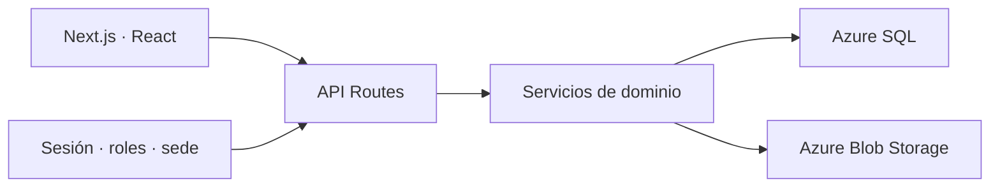

# Vision Center

### Gestión clínica y comercial multi-sede para centros ópticos

[](https://nextjs.org/) [](https://react.dev/) [](https://www.microsoft.com/sql-server/) [](#alcance-público)

Vision Center integra pacientes, citas, historias clínicas, fórmulas ópticas, inventario, facturación y usuarios bajo un contexto multi-sede.

> Este repositorio publica arquitectura y una muestra TypeScript segura. La aplicación, sus datos clínicos y el esquema completo permanecen privados.

## Problema

Una óptica necesita conectar atención clínica e inventario sin filtrar información entre sedes. La aplicación combina flujos operativos y documentos, con autorización granular y optimizaciones para equipos de recursos limitados.

## Mi responsabilidad

Desarrollo full-stack con Next.js/React/TypeScript: rutas de API, SQL Server, autenticación y roles, módulos clínicos/comerciales, almacenamiento Azure y optimización de interfaz.

## Capacidades demostradas

- Next.js App Router y React 19.
- API Routes con validación y servicios tipados.
- SQL Server/Azure SQL, procedimientos almacenados y migraciones versionadas.
- Autenticación con sesiones persistidas, bcrypt y roles.
- Aislamiento multi-sede en pacientes, inventario y facturación.
- Azure Blob Storage para documentos.
- Lazy loading, caché TTL/LRU y adaptación a dispositivos limitados.

## Arquitectura



Consulta [arquitectura](./docs/architecture.md), [decisiones](./docs/decisions.md) y [roadmap](./docs/roadmap.md).

## Muestra pública

`BranchScope` implementa un guard reutilizable que resuelve acceso por sede sin confiar en un `sedeId` enviado libremente por el cliente. Usa TypeScript y el runner de pruebas integrado de Node.

```bash
npm test
```

Revisa [código](./sample-code/branch-scope.ts), [pruebas](./tests/branch-scope.test.ts) y [OpenAPI](./api/openapi.yaml).

## Demo

No se publica la instancia clínica. Una demo futura deberá usar pacientes, historias, facturas y documentos enteramente sintéticos.

## Resultados y evidencia

La documentación privada registra optimizaciones de bundle, carga y llamadas al servidor; este showcase no repite porcentajes hasta publicar metodología y mediciones reproducibles. Sí muestra decisiones verificables: lazy loading, caché acotada, migraciones SQL y separación por servicios.

## Alcance público

| Público | Privado |
| --- | --- |
| Arquitectura y decisiones | Historias clínicas y datos personales |
| Guard multi-sede y tests | Esquema SQL/procedures completos |
| OpenAPI reducido | Credenciales, documentos y telemetría |

Seguridad: [SECURITY.md](./SECURITY.md).
