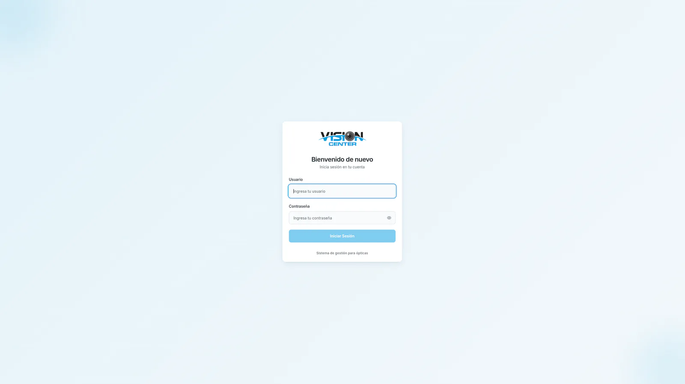

# Vision Center product tour

This public gallery is intentionally limited to views without patient-identifying or billing data. Open the [live demo](https://vision-center-app.vercel.app/) to explore the current interface with an authorized demo account.

## Appointment workflow

The schedule combines calendar navigation, daily appointments, search, and completion summaries while keeping branch context at the server boundary.

<picture>
  <source media="(max-width: 900px)" srcset="../screenshots/vision-center-appointments-light-900.webp">
  
</picture>

## Authentication

Clinical and commercial workflows remain behind a dedicated authentication boundary.

<picture>
  <source media="(max-width: 900px)" srcset="../screenshots/vision-center-login-light-900.webp">
  
</picture>

Additional operational screenshots are intentionally omitted from this public repository when they contain names, document numbers, phone numbers, or other record-level data.

Return to the [case study](../README.md) or review the [architecture](./architecture.md).
